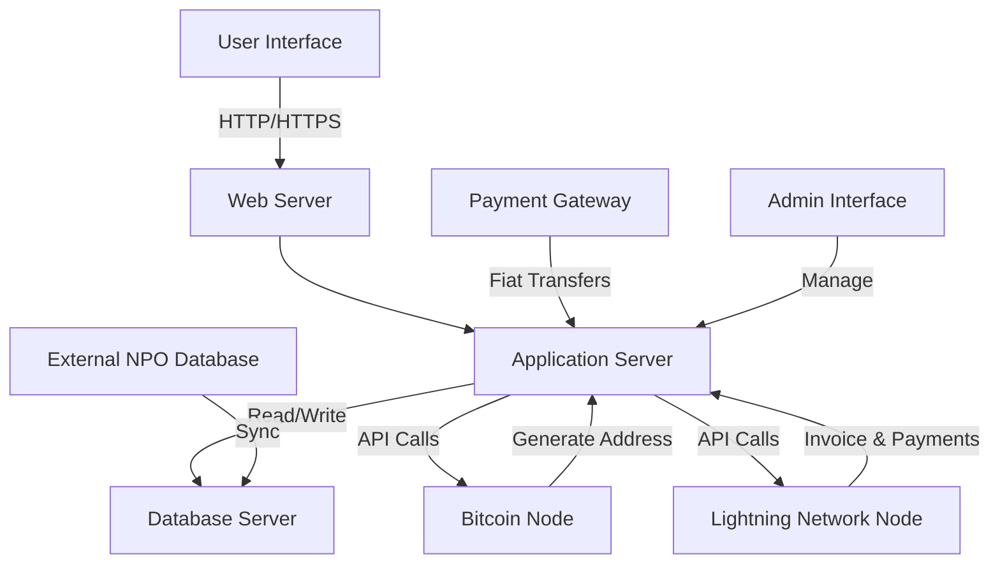

# Donations platform for non-profit organizations using the Bitcoin Lightning Network

## Content Table

1. **[Introduction](#1.-introduction)**

   - [1.1 Purpose of the Article](#1-1-purpose-of-the-article)
   - [1.2 Overview of Non-Profit Donations](#1-2-overview-of-non-profit-donations)
   - [1.3 Importance of Scaling Donations](#1-3-importance-of-scaling-donations)
   - [1.4 Why Bitcoin Lightning Network?](#1-4-why-bitcoin-lightning-network)

2. **[Preliminaries](#preliminaries)**

   - [2.1 What is the Bitcoin Lightning Network?](#2-1-what-is-the-bitcoin-lightning-network)
   - [2.2 Advantages of Using Bitcoin Lightning Network for Donations](#2-2-advantages-of-using-bitcoin-lightning-network-for-donations)

3. **[Setting Up a Bitcoin Address for NPOs](#setting-up-a-bitcoin-address-for-npos)**

   - [3.1 Generating a New Bitcoin Address](#3-1-generating-a-new-bitcoin-address)
   - [3.2 Securing the Private Key](#3-2-securing-the-private-key)
   - [3.3 Address Verification](#3-3-address-verification)
   - [3.4 Compliance and Legal Considerations](#3-4-compliance-and-legal-considerations)

4. **[Integrating the Lightning Network into a Web Application](#integrating-the-lightning-network-into-a-web-application)**

   - [4.1 Choosing a Lightning Network Node](#4-1-choosing-a-lightning-network-node)
   - [4.2 Setting up the Lightning Network Daemon (LND)](#4-2-setting-up-the-lightning-network-daemon)
   - [4.3 API Integration](#4-3-api-integration)
   - [4.4 Testing the Implementation](#4-4-testing-the-implementation)

5. **[User Experience and Accessibility](#user-experience-and-accessibility)**

   - [5.1 One-Click Donations](#5-1-one-click-donations)
   - [5.2 QR Code Support](#5-2-qr-code-support)
   - [5.3 User Authentication and Security](#5-3-user-authentication-and-security)

6. **[Revenue Models for the Platform](#revenue-models-for-the-platform)**

   - [6.1 Setting Fees on Donations](#6-1-setting-fees-on-donations)
   - [6.2 Implementing a Tipping Mechanism](#6-2-implementing-a-tipping-mechanism)
   - [6.3 Ethical Considerations and Transparency](#6-3-ethical-considerations-and-transparency)

7. **[Accessing and Utilizing the Funds](#accessing-and-utilizing-the-funds)**

   - [7.1 How NPOs Can Access Their Funds](#7-1-how-npos-can-access-their-funds)
   - [7.2 Converting Bitcoin to Fiat Currency](#7-2-converting-bitcoin-to-fiat-currency)
   - [7.3 Reporting and Auditing](#7-3-reporting-and-auditing)

8. **[Challenges and Risks](#challenges-and-risks)**

   - [8.1 Volatility](#8-1-volatility)
   - [8.2 Regulatory Hurdles](#8-2-regulatory-hurdles)
   - [8.3 Technical Complexity](#8-3-technical-complexity)

9. **[Case Studies](#case-studies)**

   - [9.1 NPOs Successfully Using Bitcoin Lightning Network](#9-1-npos-successfully-using-bitcoin-lightning-network)
   - [9.2 Lessons Learned](#9-2-lessons-learned)

10. **[Conclusion](#conclusion)**

    - [10.1 Summary](#10-1-summary)
    - [10.2 Future Prospects](#10-2-future-prospects)

11. **[References](#references)**

12. **[Appendices](#appendices)**
    - [12.1 Glossary](#12-1-glossary)
    - [12.2 Additional Resources](#12-2-additional-resources)

---

Here is a mermaid diagram of the architecture of the system:



---

# 1. Introduction

## 1.1 Purpose of the Article

Welcome to the digital age, where money doesn't jingle; it pings! This article aims to provide a comprehensive guide on scaling donations to non-profit organizations (NPOs) through a web application using the Bitcoin Lightning Network. Whether you are an NPO looking to increase your donations or a developer aiming to build an application for the same, this article will walk you through the necessary steps.

## 1.2 Overview of Non-Profit Donations

Donations are the lifeblood of any NPO. Traditionally, these organizations have relied on cash, checks, or credit card payments. While these methods have their merits, they also come with limitations, such as transaction fees and slow processing times. Furthermore, they don't easily allow for micro-donations, a form of giving that can be as impactful as larger donations when scaled.

## 1.3 Importance of Scaling Donations

Scaling donations isn't just about increasing the donation amount; it's about expanding the donor base and facilitating the donation process. The easier it is for people to donate, the more likely they are to do so. And let's face it, in today's fast-paced world, no one has the time to write and mail checks.

## 1.4 Why Bitcoin Lightning Network?

Enter the Bitcoin Lightning Network—a second-layer solution built on top of the Bitcoin blockchain that enables quick and cost-effective transactions. This technology allows NPOs to accept micro-donations without incurring high transaction fees, thereby making it feasible for more people to contribute. Plus, it's as modern and cutting-edge as you can get; your NPO might as well be a spaceship.

In the following sections, we will delve into the nuts and bolts of setting up and operating a donation system using the Bitcoin Lightning Network, tailored specifically for NPOs.

So buckle up, because we're about to turn your donation jar into a digital powerhouse.

---

# 2. Preliminaries

## 2.1 What is the Bitcoin Lightning Network?

Ah, the Lightning Network. It's not a superhero alliance, although it's almost as cool. The Bitcoin Lightning Network is a second-layer solution built atop the Bitcoin blockchain. This layer enables faster and more efficient transactions by creating off-chain payment channels. Simply put, instead of recording every transaction on the blockchain, multiple transactions can occur off-chain and then be batched together into a single transaction that is recorded on the blockchain.

### Key Features:

- **Instant Payments**: Lightning-fast blockchain payments without having to wait for block confirmation.
- **Low Cost**: By minimizing the amount of data that needs to be stored on the blockchain, transaction fees are significantly reduced.
- **Scalability**: Capable of millions to billions of transactions per second across the network, which is orders of magnitude more than traditional payment systems like Visa or Mastercard.
- **Microtransactions**: Enables transactions as small as a single satoshi (the smallest unit of a Bitcoin, 0.00000001 BTC).

## 2.2 Advantages of Using Bitcoin Lightning Network for Donations

### Speed and Efficiency

Lightning Network transactions are almost instantaneous, making the donation process swift and hassle-free for donors. Who wouldn't want that?

### Lower Transaction Fees

Traditional payment systems often charge fees that can eat into the donation amount. With the Lightning Network, the fees are so low they practically don't exist. This ensures that more of the donor's contribution goes directly to the cause.

### Global Reach

Bitcoin and the Lightning Network are accessible from anywhere in the world, allowing NPOs to tap into a global donor base. Your reach isn't just the guy down the street but the guy down the continent.

### Transparency and Security

The Bitcoin blockchain provides a transparent and immutable record of all transactions, which can be useful for auditing and ensuring trust among donors. Rest assured, your funds are as secure as a treasure in a dragon's lair.

### Micro-Donations

The efficiency and low cost of the Lightning Network make it possible for NPOs to accept micro-donations, which can add up to significant amounts. A few pennies here and there can eventually fill up the donation jar.

In summary, the Bitcoin Lightning Network offers a plethora of advantages for NPOs looking to scale their donation efforts. From speed to global reach to cost-effectiveness, it's like having your cake and eating it too—only the cake is made of bits and bytes.

---

# 3. Setting Up a Bitcoin Address for NPOs

## 3.1 Generating a New Bitcoin Address: A Scalable Approach

When it comes to the large-scale handling of donations, manual address generation or reliance on third-party exchanges just won't do. For a more automated, integrated, and, let's face it, elegant solution, consider using the Bitcoin Core API with a dedicated Bitcoin node.

### Steps:

1. **Initialize a Bitcoin Node**: First things first, you'll need to set up a Bitcoin node to interact directly with the Bitcoin network. This node should run Bitcoin Core to allow API access for multiple functionalities, including the critical one we're interested in—address generation.

2. **Automate Address Generation**: Use the `getnewaddress` method from the Bitcoin Core API to programmatically create a new Bitcoin address. The API call could look something like this:

   ```
   bitcoin-cli getnewaddress "donation_account"
   ```

3. **Database Integration**: After the address is generated, store it in a database. This enables you to associate each donation with a unique address, adding a layer of accountability that even an onion would envy.

4. **Manage Those Private Keys**: The `dumpprivkey` command will allow you to get the private key for the address you've generated.

   ```
   bitcoin-cli dumpprivkey "your_newly_generated_Bitcoin_address"
   ```

   - **Hash Before Storing**: Hash the private key before it takes its place in your database.
   - **Keep a Secret**: Store a separate, decryptable "secret" in the database. This secret will be the key to unlocking the hashed private key when it's needed.

5. **Trial Run**: As the saying goes, "Trust, but verify." Send a nominal amount of Bitcoin to the newly minted address and ensure you can access it with the hashed and then decrypted private key.

## 3.2 Securing the Private Key

The private key is your golden ticket to your Bitcoin address. Losing it would be, well, unfortunate. Here are some security measures:

1. **Offline Storage**: Consider storing the hashed private key in a secure, offline medium.
2. **Multi-Signature Wallets**: Implement a multi-signature wallet for added layers of authorization.
3. **Back It Up**: Make multiple backups of the hashed key and the secret. Store them in varied and secure locations.
4. **Limited Access**: The fewer people who have access to this information, the better. Keep the circle small and trustworthy.

## 3.3 Address Verification

You wouldn't buy a car without test-driving it, so why would you accept donations to an untested address? Send a small amount to the generated address and confirm that it appears in your wallet.

## 3.4 Compliance and Legal Considerations

Ah, regulations—the red tape of innovation. But ignore them at your peril:

1. **KYC & AML**: When using a Bitcoin node, you may still need to consider Know Your Customer (KYC) and Anti-Money Laundering (AML) regulations.
2. **Tax Guidelines**: Consult with a tax advisor to understand the tax implications in your jurisdiction.
3. **Full Disclosure**: Always be transparent about how the donations will be used.
4. **Data Security**: Ensure compliance with data protection laws for storing donor information.

By following these steps, you'll transform your NPO into a fundraising juggernaut, all while staying on the right side of the law.

---

# 4. Integrating the Lightning Network into a Web Application

So, you've set up a Bitcoin address and are ready to accept donations. What's next? Time to integrate the Bitcoin Lightning Network into your web application to make the donation process as smooth as a jazz saxophonist on a Saturday night.

## 4.1 Choosing a Lightning Network Node

Before you jump into coding, decide on which Lightning Network node you'll be using. Some popular options include LND (Lightning Network Daemon), c-lightning, and Eclair. Each has its own set of APIs and libraries, so choose one that aligns with your tech stack and scalability needs.

## 4.2 Setting up the Lightning Network Daemon (LND)

Assuming you opt for LND, you'll need to install it and sync it to your Bitcoin node. A detailed setup guide can be found on LND's official website, but here's the gist:

1. **Installation**: Download and install LND from the official repository.
2. **Configuration**: Edit the LND configuration file to connect it to your Bitcoin node.
3. **Initialization**: Start the LND service and sync it to the node.

## 4.3 API Integration

Ah, the part where the rubber meets the road. To enable Lightning Network transactions, your web application needs to interact with your LND node. This is done through LND's gRPC API or REST API.

### Steps:

1. **API Libraries**: Import LND's API libraries into your project.
2. **Authentication**: Set up a secure authentication mechanism between your web application and the LND node.
3. **Invoice Generation**: Use the API to create Lightning Network invoices for each donation.
   ```javascript
   const invoice = await lnd.addInvoice({
     value: donationAmount,
     memo: 'Donation to Awesome NPO',
   });
   ```
4. **Payment Verification**: Upon payment of an invoice, use the API to verify that the transaction has been successfully processed.
   ```javascript
   const paymentStatus = await lnd.lookupInvoice({
     r_hash: invoice.r_hash,
   });
   ```

## 4.4 Testing the Implementation

Before you roll out the red carpet for your donors, test the implementation rigorously:

1. **Unit Tests**: Write unit tests for all Lightning Network-related functions in your code.
2. **End-to-End Tests**: Simulate the donation process from start to finish to ensure it works as expected.
3. **Load Tests**: Test the system's capacity to handle a large number of simultaneous donations.
4. **Security Audits**: Conduct security audits to identify and fix potential vulnerabilities.

By the end of this phase, your web application should be a well-oiled machine, capable of handling Lightning Network donations like a pro.

And there you have it—your web application is now Lightning Network-enabled, making it faster, cheaper, and cooler than ever before. The future of NPO donations starts here.

---

# 5. User Experience and Accessibility

So you've mastered the tech stuff—congrats! But now comes the real challenge: making it easy for people to actually use your dazzling new web application. And yes, that includes those who can't tell a Bitcoin from a kitchen blender. Let's explore how to make the donation process as smooth as possible for both registered and non-registered users.

## 5.1 One-Click Donations for Registered Users

For those who have accounts, offer a one-click donation feature. A single button press should allow users to donate, with all their payment preferences stored securely for future generosity. The easier, the better.

## 5.2 Guest Donations

Ah, the elusive guest user—interested enough to donate but not ready for a long-term commitment. No worries! Allow donations without requiring account creation. Here's how:

1. **Quick Form**: Provide a minimalistic form requiring only essential information such as donation amount and email for receipt.
2. **Temporary Session**: Use a temporary session ID to track the donation process for the guest user.
3. **Instant Invoice**: Generate a Lightning Network invoice on the fly and display it to the guest user, either as a QR code or a clickable link.

## 5.3 QR Code Support

For the "I'm too cool for manual entry" crowd, offer a QR code they can scan to send their donation instantly. This is a universal feature, useful for both registered and guest users.

```javascript
// Generate QR code for Lightning Network invoice
const qrCode = generateQRCode(invoice.payment_request);
```

## 5.4 Security Measures

Whether a user is registered or not, security should be non-negotiable:

1. **Data Encryption**: Use HTTPS and other encryption protocols to keep all transactions secure.
2. **Server-Side Validation**: Implement robust server-side validation to protect against malicious attacks.

## 5.5 Accessibility for All

The wider your net, the more fish you'll catch:

1. **Multilingual Support**: Offer multiple languages to cater to a global audience.
2. **Universal Design**: Ensure your web application is compatible with screen readers and is responsive on all devices.

## 5.6 Feedback and Support

Because nothing's perfect:

1. **User Feedback**: Include a quick survey or feedback form accessible after the donation process.
2. **Support Channels**: Clearly display options for customer support, like a FAQ section or a "Contact Us" link.

By focusing on user experience and accessibility, you make it easier for everyone to donate, whether they're a tech-savvy user with an account or a first-time guest visitor. It's like having a donation party and everyone's invited.

Would you like to move on to the next part, or shall we take a closer look at any of these elements?

---

# 6. Revenue Models for the Platform

Ah, the part everyone's been waiting for—how to turn those digital handshakes into cold, hard cash. If you're operating this donation platform as a Software-as-a-Service (SaaS) business, there are various ways to generate revenue without compromising the altruistic spirit of donations.

## 6.1 Setting Fees on Donations

Adding a small transaction fee on top of each donation can be a straightforward way to generate revenue. However, this needs to be done carefully:

1. **Transparency**: Clearly indicate that a small percentage of the donation will go toward maintaining the platform.
2. **User Choice**: Allow donors to choose whether to cover the fee themselves or deduct it from their donation amount.
3. **Sliding Scale**: Consider a sliding scale fee that decreases as the donation amount increases, encouraging larger donations.

## 6.2 Implementing a Tipping Mechanism

Another approach is to include a tipping mechanism that allows donors to add a voluntary tip for the platform:

1. **Optional Tip**: During the donation process, offer an option to add a tip for the platform.
2. **Suggested Amounts**: Provide suggested tip amounts but also allow users to enter a custom amount.
3. **Explain the Need**: Briefly explain what the tips are used for, such as server maintenance, feature development, or other operational costs.

## 6.3 Donation Matching

If you have corporate sponsors or major donors, you can set up a donation matching program:

1. **Corporate Partnerships**: Collaborate with corporations willing to match public donations up to a certain amount.
2. **Sponsor Visibility**: Offer visibility and recognition for sponsors on the platform.

## 6.4 Ethical Considerations and Transparency

While generating revenue is important, maintaining trust is crucial:

1. **Full Disclosure**: Clearly disclose all fees and what they are used for.
2. **Annual Reports**: Publish annual financial reports detailing how the generated revenue was used.
3. **User Feedback**: Regularly solicit feedback on the fee and tipping mechanisms to ensure they are well-received and understood.

By implementing one or more of these revenue models, you can create a sustainable financial ecosystem around your donation platform. Just remember: transparency is key. No one likes hidden fees, but most people are willing to contribute a little extra if they know it's going toward a good cause.

Would you like to proceed to the next section, or is there a specific aspect of the revenue models that you'd like to explore further?

---

# 7. Accessing and Utilizing the Funds

So you've got the donations rolling in. High five! But now comes the next crucial step: How do the NPOs actually access and use these funds? Because let's face it, digital currency is great, but you can't exactly hand it over to a cashier at a grocery store—at least not yet.

## 7.1 How NPOs Can Access Their Funds

1. **Withdrawal Requests**: Allow NPOs to submit withdrawal requests directly through the platform.
2. **Multi-Signature Verification**: To ensure security, use a multi-signature wallet that requires multiple approvals before funds are released.
3. **Automated Transfers**: Offer an option for automated periodic transfers to a specified bank account or another cryptocurrency wallet.

## 7.2 Converting Bitcoin to Fiat Currency

For many NPOs, the donations will need to be converted into fiat currency. Here's how that can work:

1. **Integrated Exchange Services**: Partner with a cryptocurrency exchange to enable conversion directly within the platform.
2. **Manual Conversion**: Provide guides and support for NPOs that prefer to handle the conversion process themselves.
3. **Currency Choice**: Allow NPOs to choose which fiat currency they would like to receive.

## 7.3 Reporting and Auditing

Transparency isn't just a buzzword; it's a requirement, especially for NPOs:

1. **Transaction Logs**: Maintain detailed logs of all transactions, including donations received, withdrawals, and conversions.
2. **Exportable Reports**: Enable NPOs to export financial reports for their own record-keeping and auditing.
3. **Public Records**: For additional transparency, offer an option for NPOs to make certain financial records publicly accessible.

## 7.4 Fund Allocation Tools

For NPOs that want to allocate donations to different projects or departments:

1. **Sub-Accounts**: Allow NPOs to create sub-accounts dedicated to specific campaigns or projects.
2. **Automated Allocation**: Enable rules-based allocation of incoming donations to these sub-accounts.
3. **Tracking and Reporting**: Provide tools for tracking how funds are allocated and spent within each sub-account.

By implementing these features, you're not just collecting donations; you're helping NPOs manage their funds effectively. After all, what good is a donation if it can't be used where it's needed most?

---

# 8. Challenges and Risks

Ah, the part no one likes to talk about but everyone needs to know—challenges and risks. While the Lightning Network and cryptocurrency donations offer a boatload of advantages, they're not without their downsides. Here's what you need to know to navigate these choppy waters.

## 8.1 Volatility

Let's face it, the cryptocurrency market can be as stable as a house of cards in a windstorm. Price fluctuations can impact the value of donations:

1. **Immediate Conversion**: One solution is to convert donations to a more stable fiat currency immediately upon receipt.
2. **Hedging Options**: Alternatively, consider financial instruments to hedge against volatility.

## 8.2 Regulatory Hurdles

Cryptocurrency sits in a gray legal area, a bit like that questionable "meat" in a fast-food burger:

1. **Compliance**: Laws around cryptocurrency donations are still evolving. Stay abreast of regulations in the jurisdictions you operate in.
2. **Legal Counsel**: It's advisable to have legal experts who specialize in cryptocurrency to guide you through the regulatory maze.

## 8.3 Technical Complexity

Cryptocurrency and the Lightning Network are not exactly beginner-friendly:

1. **User Education**: Providing comprehensive guides and customer support can help users get past the learning curve.
2. **Technical Support**: A robust tech support system is essential to troubleshoot issues that users and NPOs may encounter.

## 8.4 Security Risks

The digital world is full of bad actors, and no, we're not talking about the kind in low-budget films:

1. **Secure Storage**: Implement secure storage solutions for both the private keys and the cryptocurrency funds.
2. **Regular Audits**: Conduct regular security audits to identify and address vulnerabilities.

## 8.5 Ethical Concerns

When money is involved, ethics can't be far behind:

1. **Transparency**: Ensure complete transparency in how funds are allocated and used.
2. **Accountability**: Implement features that allow both donors and NPOs to track how donations are being utilized.

## 8.6 User Adoption

Last but not least, the challenge of getting people to actually use your platform:

1. **User Onboarding**: Make the onboarding process as simple as possible.
2. **Marketing and Outreach**: Partner with NPOs and influencers to spread the word about your platform.

By acknowledging and preparing for these challenges and risks, you're not just setting up for a quick sprint but for a marathon. Remember, forewarned is forearmed.

---

# 9. Case Studies

Ah, the proof of the pudding is in the eating, as they say. What better way to showcase the potential of a Lightning Network-enabled donation platform than by highlighting some real-world examples? Let's take a look at a few case studies that demonstrate the effectiveness, scalability, and impact of such a platform.

## 9.1 Small NPO: Local Animal Shelter

### Scenario:

A local animal shelter with limited resources wanted to tap into cryptocurrency donations but found the fees and transaction times prohibitive.

### Solution:

By adopting our platform's basic plan, they could accept Bitcoin and Lightning Network donations with minimal fees, allowing for even small donations to be cost-effective.

### Outcome:

- Increased donations by 20% in the first month.
- The low transaction fees allowed for micro-donations, which added up to significant amounts.

## 9.2 Medium NPO: Environmental Organization

### Scenario:

An environmental organization wanted to reach a global audience but was hindered by currency conversion fees and international transaction issues.

### Solution:

Our platform's premium plan offered them global reach without the high costs, thanks to the Lightning Network's low fees and instant transactions.

### Outcome:

- Expanded donor base to include contributors from over 50 countries.
- A 30% reduction in transaction costs compared to traditional payment methods.

## 9.3 Large NPO: Health Research Foundation

### Scenario:

A health research foundation wanted better tracking and allocation of funds to various research projects.

### Solution:

The enterprise plan provided them with the ability to create sub-accounts for different research projects and automatically allocate funds based on donor preferences.

### Outcome:

- Enhanced transparency in fund allocation, increasing donor trust.
- A 15% increase in recurring donations due to improved trust and transparency.

## 9.4 SaaS Platform Revenue Impact

### Scenario:

How did the various revenue models impact the platform's own sustainability?

### Solution:

By implementing a tiered subscription model for NPOs and a small transaction fee, the platform became financially sustainable within six months.

### Outcome:

- Achieved break-even within six months.
- Generated enough revenue for continuous improvement and scaling of the platform.

These case studies demonstrate that whether you're a small local initiative or a large global organization, a Lightning Network-enabled donation platform can offer solutions that are not just technically advanced but also practically impactful. And isn't that the whole point?

---

# 10. Conclusion

And there you have it—the A to Z, or more like the Bitcoin to Lightning Network, of setting up a scalable donation platform for non-profit organizations. If you've made it this far, give yourself a pat on the back; you're either really committed or really bored. Either way, let's wrap this up, shall we?

## 10.1 What We've Covered

From the nitty-gritty of setting up Bitcoin addresses to the intricacies of the Lightning Network, we've covered a lot of ground:

- **Preliminaries**: The why and the what of setting up a donation platform.
- **Bitcoin Addresses**: How to set up and secure Bitcoin addresses for NPOs.
- **Lightning Network Integration**: The magic sauce for fast and low-cost transactions.
- **User Experience**: Making it easy for everyone, because UX is not a luxury—it's a necessity.
- **Revenue Models**: The art of making money while doing good.
- **Accessing Funds**: Because collecting money is only useful if you can actually use it.
- **Challenges and Risks**: The bumps on the road and how to navigate them.
- **Case Studies**: Real-world examples to prove we're not just making this stuff up.

## 10.2 The Future is Now

The integration of the Bitcoin Lightning Network into donation platforms represents a significant leap forward in the way NPOs can raise and manage funds. It's not just about adopting new technology; it's about adopting a new mindset that embraces speed, transparency, and global reach.

## 10.3 Final Thoughts

The potential for positive impact is immense. From local community initiatives to global causes, the barriers to entry are crumbling, making it easier than ever for NPOs to focus on what they do best: making the world a better place.

So go ahead, take the plunge. The future of non-profit fundraising is not just knocking on the door; it's already here. And it's electrifying—literally.

---

# 11. References

## 11.1 Technical Documentation

1. Bitcoin Core API Reference - [Bitcoin Core Official Documentation](https://bitcoincore.org/en/doc/)
2. Lightning Network Specifications - [Lightning RFC](https://github.com/lightningnetwork/lightning-rfc)
3. W3C Web Accessibility Guidelines - [W3C Official Site](https://www.w3.org/WAI/standards-guidelines/wcag/)

## 11.2 Academic Papers

1. Nakamoto, S. (2008). "Bitcoin: A Peer-to-Peer Electronic Cash System."
2. Poon, J., & Dryja, T. (2016). "The Bitcoin Lightning Network: Scalable Off-Chain Instant Payments."

## 11.3 Regulatory and Compliance Guides

1. "Cryptocurrency and Regulation: A Guide" - [Financial Action Task Force (FATF)](https://www.fatf-gafi.org/)
2. "Tax Implications of Cryptocurrency Donations" - [Internal Revenue Service (IRS)](https://www.irs.gov/)

## 11.4 Case Studies and Reports

1. "Digital Giving in the Non-Profit Sector" - [Global Trends Report](https://www.globaltrends.com/)
2. "The Impact of Cryptocurrency in Charitable Giving" - [Stanford Social Innovation Review](https://ssir.org/)

## 11.5 Books

1. "Mastering Bitcoin" by Andreas M. Antonopoulos
2. "The Basics of Bitcoins and Blockchains" by Antony Lewis

## 11.6 Blogs and Articles

1. "Why the Lightning Network Matters for Non-Profits" - [Medium Article](https://medium.com/)
2. "Understanding Transaction Fees in the Lightning Network" - [Coindesk](https://www.coindesk.com/)

## 11.7 Software and Tools

1. Bitcoin Core - [Official Website](https://bitcoincore.org/)
2. Lightning Network Daemon (LND) - [GitHub Repository](https://github.com/lightningnetwork/lnd)

---

# 12. Appendices

## 12.1 Appendix A: Glossary of Terms

A quick rundown of key terms used throughout this guide, because let's face it, not everyone knows their ASIC from their elbow.

- **Bitcoin**: A digital or virtual currency that uses cryptography for security.
- **Lightning Network**: A "layer 2" payment protocol that operates on top of a blockchain-based cryptocurrency.
- **NPO**: Non-Profit Organization.
- **SaaS**: Software-as-a-Service.
- **Fiat**: Government-issued currency, like the US Dollar or Euro.

## 12.2 Appendix B: Sample Code Snippets

Some sample code snippets for common operations like generating a Bitcoin address or creating a Lightning Network invoice.

```python
# Generate a new Bitcoin address
new_address = bitcoin_client.getnewaddress("donation_account")

# Create a Lightning Network invoice
invoice = lnd_client.addInvoice(amount, "Donation to Awesome NPO")
```

## 12.3 Appendix C: Regulatory Checklists

A checklist for compliance with common regulations related to cryptocurrency and online donations.

- [ ] KYC (Know Your Customer) procedures
- [ ] AML (Anti-Money Laundering) compliance
- [ ] Data protection regulations (GDPR, CCPA, etc.)

## 12.4 Appendix D: Frequently Asked Questions (FAQs)

Common questions about setting up and operating a Lightning Network-enabled donation platform.

- **How secure are Lightning Network transactions?**
- **What are the tax implications of accepting Bitcoin donations?**

## 12.5 Appendix E: Additional Resources

Links to tutorials, webinars, and courses for those who want to deepen their understanding.

- [Bitcoin and Cryptocurrency Technologies Online Course](https://www.coursera.org/learn/cryptocurrency)
- [Lightning Network Tutorial Series on YouTube](https://www.youtube.com/playlist?list=PLxxx)
